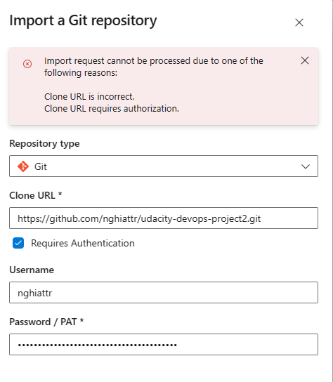

[](https://github.com/nghiattr/udacity-devops-project2/actions/workflows/pylint.yml)


# Udacity Project 2: Building a CI/CD Pipeline
test
## Overview & Architectural Diagram

Purpose of this project is build and deploy a Flask Webapp based on several tools: Github, Github Action, Azure ADO, Azure pipeline.


## How to running this Python project (Flask)

1. Create the virtual environment using python
```bash
python3 -m venv flask-ml-azure
source flask-ml-azure/bin/activate
```

2. Install dependencies in requirement.txt file
```bash
make install
```

3.1 Start webapp in local
```bash
python3 app.py
```


4.1 In a separate shell run: `./make_prediction.sh`


3.2 Create a Azure Web App service in Azure cloud shell *Note: replace "< yourappname >" before executing.
```bash
./commands.sh
```


4.2 In a separate shell run: `./make_predict_azure_app.sh`
*Note: replace "< yourappname >" before executing.

## Step by step to create a CICD pipline

1. Create a Azure Devops Organization


2. Create a Git repository by import the Github repo




3. Create a Agent pools and Agent VM for Azure pipeline


Create a access token for Agent can connect to the Pools


Create pools


Create agent


SSH to the VM which is the agent and run the scripts above


4. Create a Service connections 


5. Create a Azure Pipeline


6. Trigger the pipeline to build & deploy Flask application into Azure Web App Service


Grant the permission for pipeline


Check rsult:


For more detai please access the Video links in "Demo links" part


## Link of the Trello board


https://trello.com/b/ormxYoYZ/nghiaproject


## Continuous Integration


A screenshot showing the project cloned into Azure Cloud Shell:


A screenshot showing the passing tests that are displayed after running the make all command from the Makefile and output of a test run:


## Continuous Delivery


Locust: 
```bash
locust -f locustfile.py
```

Result:


and the report: locust-report.html


## Demo Links:


Github Action: 


CICD: 

