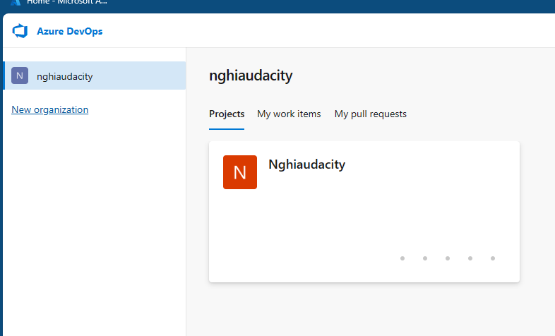
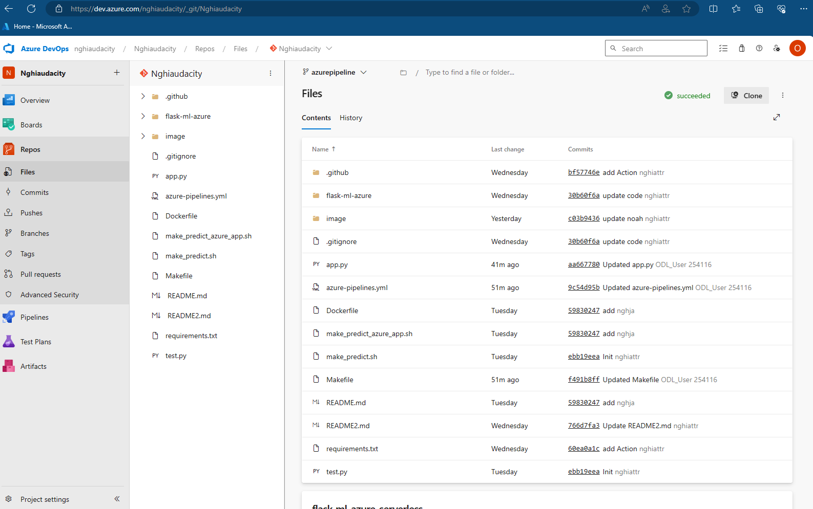
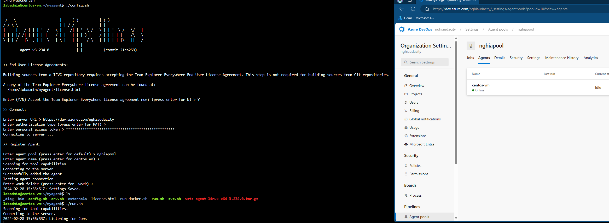
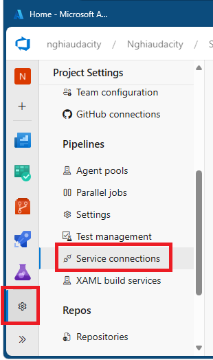
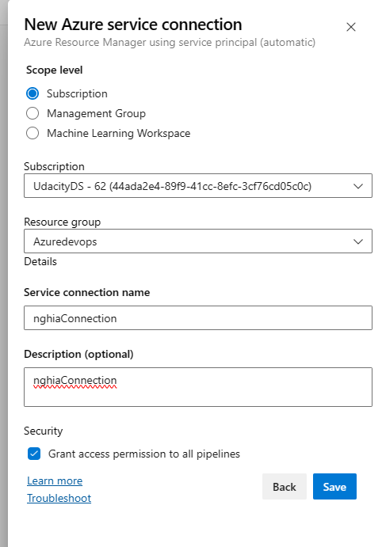
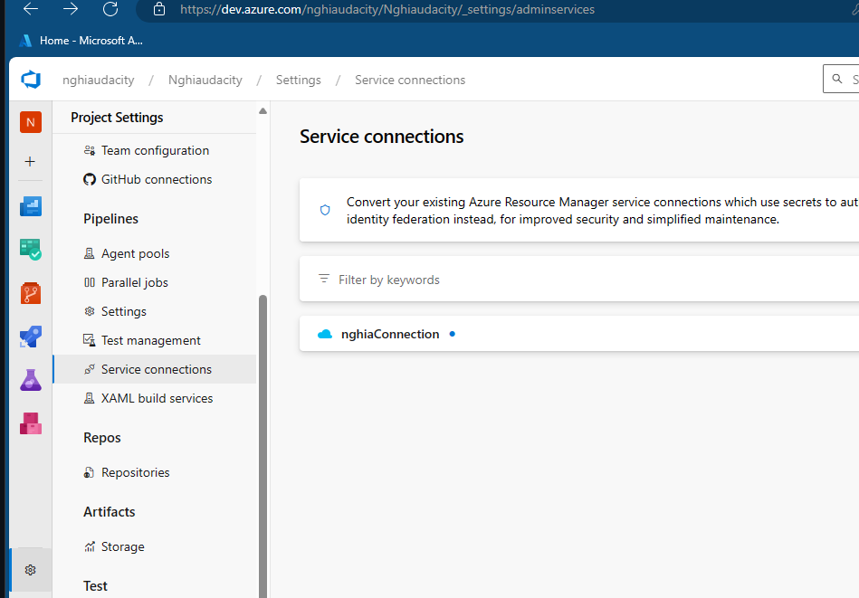

[](https://github.com/nghiattr/udacity-devops-project2/actions/workflows/pylint.yml)


# Udacity Project 2: Building a CI/CD Pipeline


## Overview & Architectural Diagram

The purpose of this project is to build and deploy a Flask Webapp using various tools such as GitHub, GitHub Actions, Azure ADO, and Azure Pipeline.


## Running the Python Flask Project

1. Create a virtual environment using Python:
```bash
python3 -m venv flask-ml-azure
source flask-ml-azure/bin/activate
```

2. Install dependencies from the `requirements.txt` file:
```bash
make install
```

3.1 Start the web application locally:
```bash
python3 app.py
```


4.1 In a separate shell, run: `./make_prediction.sh`


3.2 Create an Azure Web App service in Azure Cloud Shell (Note: replace "< yourappname >" before executing):
```bash
./commands.sh
```


4.2 In a separate shell, run: `./make_predict_azure_app.sh` (Note: replace "< yourappname >" before executing).


## Step by step to create a CICD pipline

1. Create an Azure DevOps Organization:




2. Import the GitHub repository to create a Git repository:





3. Set up Agent pools and Agent VMs for Azure Pipeline:


Create an access token for agents to connect to the pools.


Create pools.


Create agents.


SSH to the VM, which acts as the agent, and execute the provided scripts.





4. Create Service connections:











5. Set up an Azure Pipeline:


6. Trigger the pipeline to build & deploy the Flask application to Azure Web App Service:


Grant permission for the pipeline:


Check the result:


For more details, please refer to the video links in the "Demo Links" section.


## Link to the Trello Board


[Trello Board Link](https://trello.com/b/ormxYoYZ/nghiaproject)

| Task Description                                           | Quarter | Week | Estimated Time (hours) | Actual Time (hours) |
|------------------------------------------------------------|---------|------|------------------------|----------------------|
| Core DevOps Principles Documentation                       | Q1      | 1    | 10                     | 8                     |
| Create Azure DevOps Project Estimate Document             | Q1      | 2    | 8                      | 8                     |
| Set Up GitHub Repository                                  | Q1      | 3    | 4                      |  8                    |
| Initial Codebase Setup                                    | Q1      | 3    | 6                      | 8                     |
| Implement Continuous Integration with Azure Cloud Shell   | Q1      | 4    | 12                     | 8                     |
| Use GitHub Actions for Continuous Integration             | Q2      | 5    | 10                     | 8                     |
| Implement Continuous Delivery with Azure Pipelines       | Q2      | 6    | 14                     |  8                   |
| Load Testing using Locust                                 | Q2      | 7    | 10                     | 8                     |
| Deploy Application to Azure App Services using Azure CLI  | Q3      | 9    | 8                      |  8                    |
| Test Application within Azure Pipelines                  | Q3      | 10   | 6                      |   8                   |
| Documentation Refinement                                  | Q4      | 12   | 8                      | 8                     |
| Create Professional Demo of Azure DevOps Application      | Q4      | 13   | 10                     | 8                     |


## Continuous Integration


A screenshot demonstrating the project cloned into Azure Cloud Shell:


A screenshot showing the passing tests displayed after running the make all command from the Makefile, along with the output of a test run:


## Continuous Delivery


To run Locust:
```bash
locust -f locustfile.py
```

Result:


And the report: `locust-report.html`


## Demo Links:


[Github Action](https://youtu.be/FIfIcomB-Ak)


[CICD](https://youtu.be/NnCFK7AULq0)